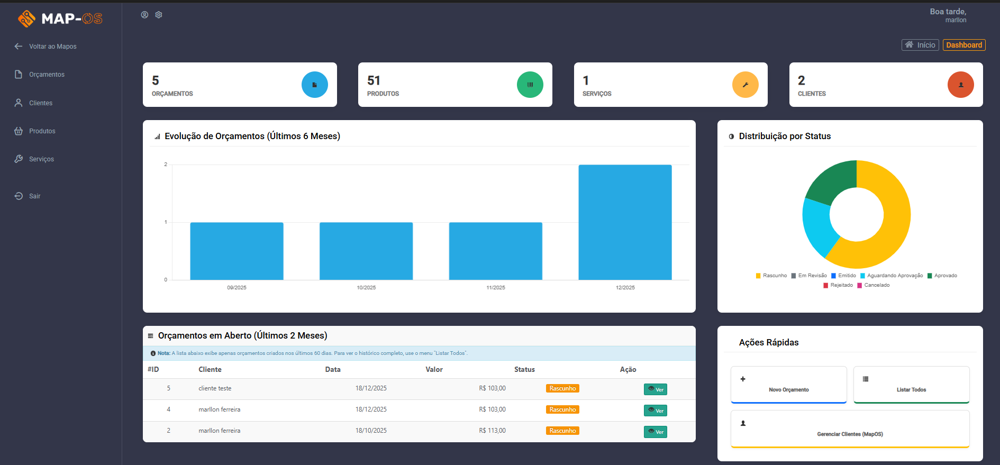
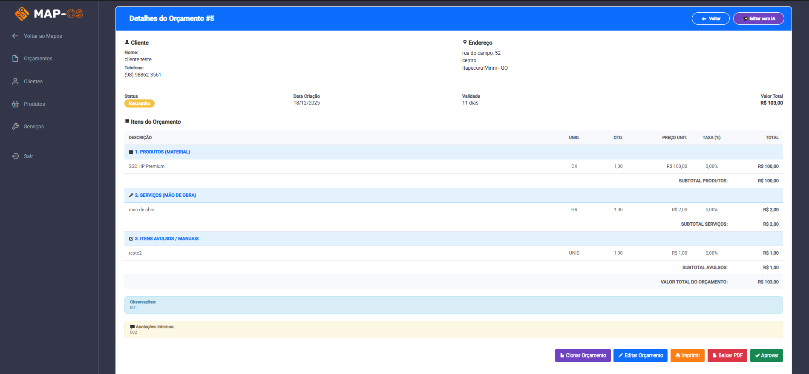
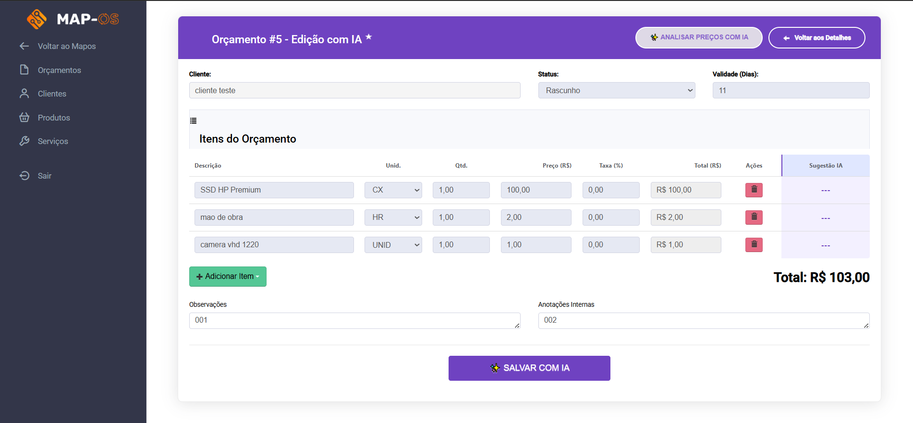

# Módulo de Orçamentos (Independente) - Mapos


[](https://github.com/marllonferreira/modulo_orcamentos)

Este é um módulo de gestão de orçamentos projetado para funcionar de forma **independente** dentro do ecossistema Mapos.

### 🛡️ Principais Diferenciais
- **Blindado contra Atualizações:** Por residir em uma pasta separada (`/modulos`), você pode atualizar o núcleo do Mapos tranquilamente; este módulo **não será sobrescrito ou afetado**.
- **Instalação Inteligente (Auto Instalador):** Possui sistema de detecção automática que verifica o ambiente e redireciona para um assistente de instalação caso falte alguma tabela ou dependência. Simples e sem complicação.
- **Design & Experiência:**
    - **Interface Moderna:** Visual otimizado e responsivo, inspirado nos padrões mais recentes.
    - **Temas Independentes:** Sistema próprio de temas, isolado para garantir estabilidade visual.
    - **Mobile First:** Tabelas e layouts ajustados para visualização perfeita em celulares e tablets.
- **Motor de Cálculo Avançado:** Realiza cálculos automáticos em tempo real, com suporte nativo a **Taxas/Comissões (%)** por item.
- **Gestão Completa de Orçamentos:**
    - **Múltiplos Status:** Controle total do fluxo (Rascunho, Aguardando Aprovação, Em Revisão, Aprovado, Emitido, Cancelado, etc).
    - **Impressão Profissional:** Geração de orçamentos e relatórios em PDF (via mPDF) limpos e organizados, com layout profissional, cabeçalho e tabelas zebradas.
    - **Validade:** Campo informativo para definir a validade da proposta em dias.
    - **Notificações:** Alerta visual para orçamentos que atingiram a data limite de validade.
- **Impressão Inteligente (Jurídico/Fiscal):** Recurso exclusivo que permite selecionar o tipo de orçamento (Venda ou Mão de Obra) na hora de imprimir, ajustando automaticamente os textos legais de isenção e responsabilidade, garantindo maior proteção jurídica ao prestador.
- **Relatórios Avançados:** Filtros por data, cliente e status, estatísticas e geração de PDF.
- **Inteligência Artificial:** Integração nativa com **Google Gemini** para sugestão inteligente de preços de mercado.
- **Integração Total:** Apesar de independente nos arquivos, ele lê e grava diretamente no banco de dados oficial do Mapos (clientes, produtos, serviços), garantindo integridade dos dados.
- **Segurança Reforçada:** Proteção nativa contra XSS (Sanitização no Frontend) e CSRF (Tokens Backend), garantindo que apenas usuários autenticados e via formulários legítimos possam interagir com o sistema.


### 🖼️ Screenshots (Algumas telas do sistema)

#### Dashboard (Tela Inicial com graficos)

<br><br>

#### Dashboard (Tela Inicial com ultimos orçamentos)

<br><br>

#### Lista de Orçamentos

<br><br>

#### detalhes do orçamento

<br>

#### detalhes do orçamento part2

<br>

#### Edição

<br>

#### Edição com Inteligência Artificial

<br>

#### Relatórios

<br>

---
<!-- ... (resto do arquivo ) ... -->


---

## 💻 Requisitos do Sistema
- **PHP:** Versão 8.2 ou superior (Compatível com PHP 8.4/8.5+).
- **Mapos:** Compatível a partir da versão **v4.49.0**. Testado e validado até a versão **v4.53.0** (atual). Devido à sua arquitetura independente, é altamente provável que mantenha compatibilidade com versões futuras.
- **Versões Antigas:** O uso em versões inferiores é possível, mas pode exigir adaptações manuais no núcleo e no ambiente PHP (mínimo 8.2), sendo de inteira responsabilidade do usuário.

---

## 🚀 Instalação e Acesso

### 0. Pré-requisito: Instale o Mapos
Antes de instalar este módulo, você precisa ter o **Mapos** rodando. Se ainda não tem:
1.  Baixe o Mapos oficial em [github.com/RamonSilva20/mapos](https://github.com/RamonSilva20/mapos).
2.  Siga o tutorial de instalação oficial do Mapos.
3.  Com o Mapos funcionado, prossiga abaixo.

### 1. Preparando o Módulo (No seu computador)

1.  **Baixe o arquivo:** Faça o download do arquivo ZIP do repositório (ex: `modulo_orcamentos-main.zip`).
2.  **Descompacte:** Extraia o conteúdo do arquivo ZIP.
3.  **Renomeie a pasta:** A pasta extraída terá o nome `modulo_orcamentos-main`. **Renomeie esta pasta para apenas `orcamentos`.**
    *   ❌ Incorreto: `modulos/modulo_orcamentos-main`
    *   ✅ Correto: `modulos/orcamentos`

### 2. Resolvendo Dependências (Pasta `vendor`)

Antes de prosseguir, verifique se a pasta `vendor` já existe dentro da pasta `orcamentos`.
*   **Já existe?** Ótimo, pule para o passo 3.
*   **Não existe?** Siga uma das opções abaixo:

#### Opção A: Automático (Se você tem Composer)
Abra o terminal na pasta e rode o comando:

```bash
composer install
```

#### Opção B: Direto na Hospedagem (SSH/Terminal)
Se você tem acesso avançado à sua hospedagem (via SSH ou Terminal do cPanel) e sabe o que está fazendo:
1.  Faça o upload do módulo para a pasta `modulos/` do seu servidor.
2.  Acesse o servidor via terminal.
3.  Entre na pasta: `cd seusistema/modulos/orcamentos`.
4.  Rode o comando: `composer install`.

#### Opção C: Manual (Sem Composer)
Se você não tem o composer instalado e nem acesso ao terminal da hospedagem:
1.  Baixe o **DomPDF** [neste link](https://github.com/dompdf/dompdf/releases) (ex: `dompdf-3.1.4.zip`).
2.  Descompacte o arquivo. Ele criará uma pasta chamada `dompdf`.
3.  Dentro da pasta `dompdf`, você verá uma pasta chamada `vendor`. Copie essa pasta `vendor` inteira para dentro da sua pasta `orcamentos`.
    *   O caminho final deve ser: `orcamentos/vendor/`

> **Dica:** O método automático (Opção A) é sempre preferível para garantir que todas as dependências estejam na versão correta.

### 3. Instalação no Sistema

1.  Pegue a pasta `orcamentos` (já renomeada e com a pasta `vendor` dentro).
2.  Mova-a para a pasta `modulos` na raiz do seu Mapos. Caso essa pasta não exista, você deve criá-la.  
    O caminho final deve ser: `seusistema/modulos/orcamentos`.

### 4. Configuração de URL (Importante ⚙️)

O arquivo principal de configuração é o `config_geral.php`. Ele tenta detectar automaticamente a maioria dos caminhos, mas **atenção especial** deve ser dada à URL raiz do sistema.

#### Renomeando a Pasta do Projeto

Se você alterar o nome da pasta principal do projeto (ex: de `mapos` para `os`), você precisa ajustar a constante `MAPOS_URL` no arquivo `config_geral.php`.

**Arquivo:** `config_geral.php`

```php
// ...

// 🛑 AQUI: Se a pasta do seu projeto mudou, altere '/mapos/' para o novo nome (ex: '/os/')
// 💡 DICA: Se o sistema estiver na RAIZ do domínio, use apenas '/'
define('MAPOS_URL', $protocol . $host . '/mapos/'); 

// ...
```

#### Por que alterar apenas isso?

As outras constantes (`MAPOS_PATH` e `MAPOS_ROOT_PATH`) utilizam caminhos relativos ao sistema de arquivos (`dir/../../`), então elas se "auto-ajustam" independentemente do nome da pasta raiz, contanto que a estrutura interna de diretórios (`modulos/orcamentos`) seja mantida.

A URL pública (`MAPOS_URL`), no entanto, depende de como o servidor web (Apache/Nginx) enxerga sua pasta, por isso precisa ser definida manualmente se fugir do padrão `/mapos/`.

### 5. Como Acessar (Importante ⚠️)

> [!TIP]
> **Tudo pronto? Vamos lá!** 🚀
> 
> Este módulo é protegido pelo sistema de segurança do Mapos e possui **Auto-Instalação**.
> Basta tentar acessar a URL abaixo e o sistema fará o resto.

1. Faça **login no Mapos principal** normalmente.
2. Acesse a lista de orçamentos pela URL:
   `http://seusistema/modulos/orcamentos/`
3. Se for o primeiro acesso, o sistema detectará automaticamente a necessidade de instalação e levará você para a tela de configuração.
4. Siga os passos na tela (se necessário) e pronto!

## 🛠️ Instalação Manual (Método Alternativo)

Se você preferir fazer tudo manualmente ou se o instalador automático falhar:

### 🗄️ Banco de Dados (Manual)
1. Localize o arquivo `instalar_tabelas_orcamento.sql` na raiz desta pasta `orcamentos`.
2. Importe este arquivo para o banco de dados do seu Mapos.

<!-- Seção de dependências movida para o fluxo principal de instalação -->

## 🔗 Integração no Menu (Opcional)

 Para facilitar o acesso, você pode adicionar um botão no menu lateral do Mapos.
 **Nota:** Como o menu faz parte do "core" do Mapos, essa alteração pode ser perdida se você atualizar o sistema.
 
- 📖 **Tutorial Detalhado:** Para um passo a passo com dicas de posicionamento, veja o [Guia de Integração Detalhado](TUTORIAL_INTEGRACAO.md).
 
 1. Edite o arquivo: `application/views/tema/menu.php`
 2. Procure o local onde quer inserir o botão (ex: logo abaixo do menu de "Vendas").
 3. Cole o seguinte código:
 
 ```php
 <!-- Botão Módulo Orçamentos (Novo) -->
 <li class="<?= (strpos($_SERVER['REQUEST_URI'], 'modulos/orcamentos') !== false) ? 'active' : '' ?>">
     <a class="tip-bottom" title="" href="<?= base_url() ?>modulos/orcamentos">
         <i class='bx bx-file-blank iconX'></i>
         <span class="title">Orçamentos (Novo)</span>
         <span class="title-tooltip">Orçamentos</span>
     </a>
 </li>
 ```

> **⚠️ Atenção:** Como o arquivo `menu.php` pertence ao núcleo do Mapos, ele pode ser sobrescrito em uma atualização do sistema, fazendo o botão sumir. Se isso acontecer, basta refazer este passo.

## ✨ Inteligência Artificial (Configuração)

Após instalar o módulo, você pode ativar os recursos de IA para auxiliar na precificação de orçamentos.

**Funcionalidades:**
- **Sugestão de Preços:** A IA analisa a descrição do item e sugere um preço médio de mercado.
- **Rotação de Chaves de API:** Sistema inteligente que alterna entre múltiplas chaves configuradas para evitar bloqueios por limite de uso.
- **Modelo Otimizado:** Utiliza por padrão o **Gemini 2.5 Flash Lite** e **gemini-2.5-flash**.

### 🔑 Configurando a IA (Passo a Passo)

Para utilizar os recursos de inteligência artificial, você precisará de uma chave de API do Google Gemini. É gratuito (com limite de uso) e fácil e poderar obter mais de uma chave.

#### 1. Obtendo a Chave de API
1.  Acesse o [Google AI Studio](https://aistudio.google.com/app/apikey).
2.  Faça login com sua conta Google.
3.  Clique no botão **"Create API key"**.
4.  Crie um nome para a chave e selecione a opção **"Escolha um projeto importado"** depois selecione o projeto que desejar ou crie um novo projeto.
5. depois de criar a chave Copie o código gerado (começa com `AIza...`).

#### 2. Configurando no Sistema
1.  Vá até a pasta do módulo: `modulos/orcamentos/orcamentos/`.
2.  Abra o arquivo `config_ia.php` num editor de texto.
3.  Localize a linha que define as chaves:
    ```php
    define('GEMINI_API_KEYS', [
        'COLE_SUA_CHAVE1_AQUI',
        'COLE_SUA_CHAVE2_AQUI',
    ]);
    ```
4.  Cole a chave que você copiou do Google. Salve o arquivo.
atenção: você pode adicionar mais de uma chave para evitar bloqueios por limite de uso basta copiar a chave e colar abaixo da primeira chave como no exemplo acima.

#### 3. Ativando/Desativando a IA
No mesmo arquivo `config_ia.php`, você encontrará a opção:
```php
define('IA_ENABLED', true); // true = Ativado | false = Desativado
```
por padrão esta opção esta desativada, caso queira ativar a IA basta mudar para `true` nao esqueça de adicionar a chave de API.

## 💾 Backup e Segurança

### Backup do Banco de Dados
Embora o backup geral do Mapos já inclua todas as tabelas (inclusive as deste módulo), o módulo possui uma ferramenta dedicada para gerar backup **apenas das tabelas de orçamento**.
- Recomenda-se realizar este backup antes de atualizações críticas.

### Backup dos Arquivos
Antes de atualizar o Mapos, por segurança, você pode copiar a pasta `modulos/orcamentos` para um local seguro. Assim, se algo der errado, basta copiar a pasta de volta.
Graças à arquitetura modular, **o módulo não deve ser afetado por atualizações do sistema**, mas o seguro morreu de velho! 😉

---

---


## 📜 Licença e Isenção de Responsabilidade

Este módulo é um software de **Código Aberto (Open Source)**, não comercializado.

- **Uso Livre:** Qualquer pessoa pode baixar, usar e modificar.
- **"Do It Yourself" (Faça Você Mesmo):** O módulo é entregue "como está", sem garantias.
- **Sem Suporte (Nem do Mapos Oficial):** Este é um projeto independente. **A equipe oficial do Mapos não oferece suporte a este módulo**, assim como o criador deste módulo também não oferece.
- **Responsabilidade:** A instalação e uso são de inteira responsabilidade do usuário (conta e risco).

Adaptado para trabalhar com PHP 8.2+. Compatível com as versões mais recentes do PHP 8.x. Sinta-se à vontade para colaborar!
